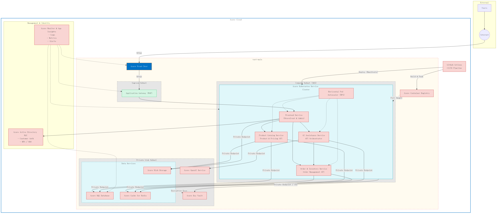
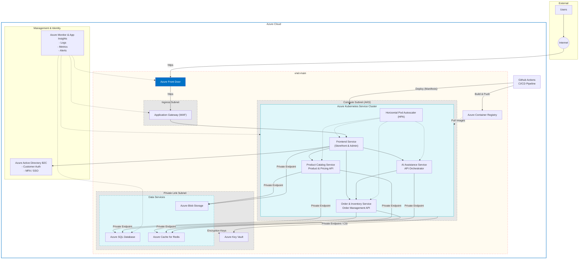

# Cloud Architecture (Azure)

This document outlines the target cloud architecture for the AI-assisted Online Shopping for Luxury Products (OSLP) platform, based on the Project Proposal Final Report.

## Architecture Diagram (Mermaid)

The following diagram represents the **Phase 2 Target State** (Kubernetes Microservices), optimized for security and high availability.

## Component Breakdown

### 1. Edge & Entry
- **Azure Front Door**: Global load balancer with CDN capabilities to ensure low latency and high availability.
- **Application Gateway (WAF)**: Regional load balancer deployed in a dedicated `Ingress Subnet`. Protects the AKS cluster from web vulnerabilities (OWASP Top 10).

### 2. Compute (AKS)
- **Azure Kubernetes Service (AKS)**: Hosted in the `Compute Subnet`.
- **Microservices**:
    - `Frontend`: Storefront and Admin UI.
    - `Product`: Catalog and Pricing API.
    - `Order`: Inventory and Order Management.
    - `AI Orchestrator`: Manages interaction with Azure OpenAI.
- **Scaling**: Horizontal Pod Autoscaler (HPA) adjusts replica counts based on demand.

### 3. Networking & Security
- **VNet Structure**:
    - `Ingress Subnet`: Dedicated for Application Gateway.
    - `Compute Subnet`: Dedicated for AKS Nodes.
    - `Private Link Subnet`: Hosting Private Endpoints for PaaS resources.
- **Private Link**: Ensures traffic between AKS and Data/AI services travels over the Microsoft backbone network, never the public internet.
- **Azure AD B2C**: Handles customer identity.
- **Azure Key Vault**: Stores secrets, accessed via CSI Driver or Private Link.

### 4. Data & AI (PaaS)
- **Azure SQL Database**: Relational store.
- **Azure Cache for Redis**: High-performance caching.
- **Azure Blob Storage**: Media assets.
- **Note**: *Azure OpenAI Service* is currently omitted in favor of direct API usage but is planned for future phases to enhance security and compliance.

## Infrastructure as Code (Terraform)

The infrastructure is defined using Terraform in the `infrastructure/terraform` directory.

### Prerequisites
- Terraform >= 1.0
- Azure CLI
- Active Azure Subscription

### Deployment
1. `cd infrastructure/terraform`
2. `terraform init`
3. `terraform plan -out main.tfplan`
4. `terraform apply main.tfplan`
